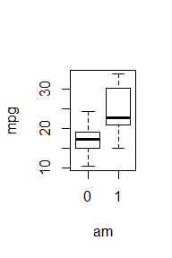
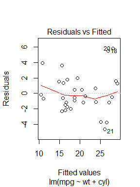
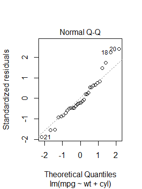
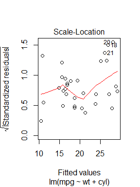
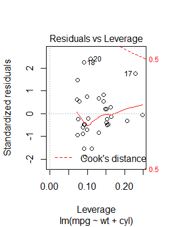

#### Executive Summary
Motor Trends wants to explore the relationship between variables and miles per gallon (MPG)
answering the specific questions:  

* “Is an automatic or manual transmission better for MPG”
* "Quantify the MPG difference between automatic and manual transmissions"  

A multiple linear regression was applied.  The resulting final model suggests that
a statistically significant correlation between transmission type and MPG cannot
be inferred.  Rather, weight and the number of clyinders have the strongest statistically
correlation with MPG.  


### Process

##### Dataset cleaning
The dataset was taken from 1974 Motor Trend, consists of 11 variables (including 
MPG) and 32 observations.  The data is a mix of continuous values (such as Gross Horse Power) and 
factors (like number of cylinders).  No empty or inappropriate data values were found.


##### Exploratory Analysis

A summary of data was taken to determine the range, mean and media of data.
A scatterplot was used to see if potential correlation between different variables.  It was noted that weight, horsepower, displacement and cylinder all showed
clear trends with relation to MPG.  Furthermore a boxplot shows that the range of MPG values
are higher for variable am 1 (automatic transmission).

<!-- -->

##### Multiple Linear Regression Analysis

Model strategy  

* Created linear model with all variables, identified the most significant variables:
weight, horsepower, transmission type, displacement and number of clyinders  
* Found high variable inflation factor between weight, horsepower and displacement
* Experimented with variables and found that the variables weight and number of cylinders
created the most parsimonious model with the best combination of statistical significance, 
small residuals, high R2 values and low variable inflation factor.  
* The combination of horse power and weight also provided a good model.  
* The type of transmission variable did not show statistical significance when combined with weight,
number of cylinders or horse power variables suggesting the type of transmission is 
not statistically correlated to MPG.
* An anova analysis was consistent with this finding showing type of transmission is
not statistically significant compared to earlier nested models.

Residual and heterodeskedacity tests for weight + number of clyinders linear regression model 

* Influence measures showed no strong leverage outliers.
* Various residual plots show no unacceptably large residuals.
* The heteroskedascity test failed to reject the null hypothesis that the variance is not constant 
(though the p value was close to the 0.05 value)

Findings 

* Failed to reject the hypothesis that the type of transmission is statistically correlated to MPG.  
* When the type of transmission is included in the linear regression model, the increase in MPG is very small (less than 1 MPG).  
* Weight and number of cylinders were statistically significant.  Per increase of 1/2 ton, the MPG drops 3.2 MPG, and relative to cylinder 4, a 6-cylinder engine decreases MPG by 4.2 and a 8-cylinder engine decreases MPG by 6.  

***

#### Appendix  

##### Linear Modelling

```
## 
## Call:
## lm(formula = mpg ~ wt + cyl, data = proc_data)
## 
## Residuals:
##     Min      1Q  Median      3Q     Max 
## -4.5890 -1.2357 -0.5159  1.3845  5.7915 
## 
## Coefficients:
##             Estimate Std. Error t value Pr(>|t|)    
## (Intercept)  33.9908     1.8878  18.006  < 2e-16 ***
## wt           -3.2056     0.7539  -4.252 0.000213 ***
## cyl6         -4.2556     1.3861  -3.070 0.004718 ** 
## cyl8         -6.0709     1.6523  -3.674 0.000999 ***
## ---
## Signif. codes:  0 '***' 0.001 '**' 0.01 '*' 0.05 '.' 0.1 ' ' 1
## 
## Residual standard error: 2.557 on 28 degrees of freedom
## Multiple R-squared:  0.8374,	Adjusted R-squared:   0.82 
## F-statistic: 48.08 on 3 and 28 DF,  p-value: 3.594e-11
```

```
##         GVIF       Df GVIF^(1/(2*Df))
## wt  1.606268 1.000000        1.267386
## cyl 1.606268 1.414214        1.125782
```

```
## Analysis of Variance Table
## 
## Model 1: mpg ~ wt
## Model 2: mpg ~ wt + cyl
## Model 3: mpg ~ wt + cyl + am
##   Res.Df    RSS Df Sum of Sq      F   Pr(>F)   
## 1     30 278.32                                
## 2     28 183.06  2    95.263 7.0288 0.003488 **
## 3     27 182.97  1     0.090 0.0133 0.908947   
## ---
## Signif. codes:  0 '***' 0.001 '**' 0.01 '*' 0.05 '.' 0.1 ' ' 1
```

<!-- --><!-- --><!-- --><!-- -->

```
## Warning: `prepend()` is deprecated as of rlang 0.4.0.
## 
## Vector tools are now out of scope for rlang to make it a more
## focused package.
## This warning is displayed once per session.
```

```
## 
##  Breusch Pagan Test for Heteroskedasticity
##  -----------------------------------------
##  Ho: the variance is constant            
##  Ha: the variance is not constant        
## 
##          Data           
##  -----------------------
##  Response : mpg 
##  Variables: wt cyl6 cyl8 
## 
##         Test Summary (Unadjusted p values)       
##  ----------------------------------------------
##   Variable           chi2      df        p      
##  ----------------------------------------------
##   wt               2.369973     1    0.12368922 
##   cyl6             3.064224     1    0.08003338 
##   cyl8             1.046881     1    0.30622660 
##  ----------------------------------------------
##   simultaneous     7.393077     3    0.06037037 
##  ----------------------------------------------
```
