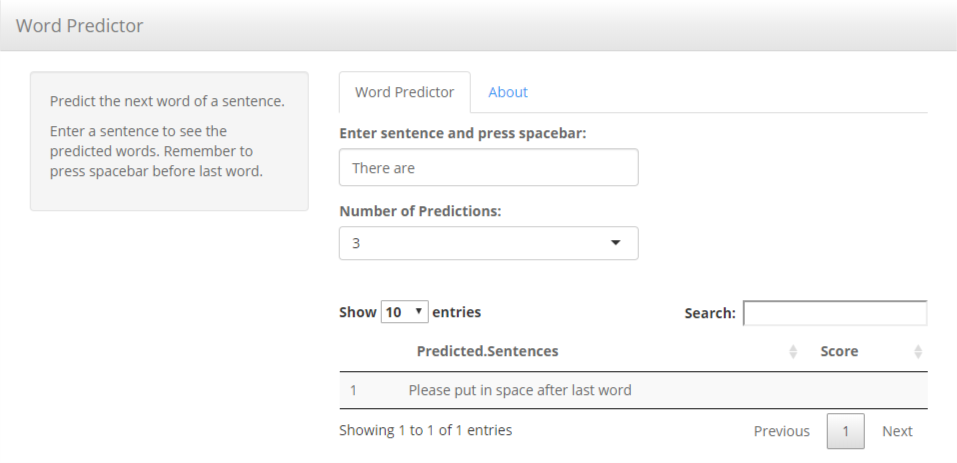

```{r setup, include=FALSE}
knitr::opts_chunk$set(echo = FALSE)
```

## Summary

- Goal - create a model that can predict
- Approach - used stupid back-off algorithm, expanded corpus
- Result - using benchmark.R, here are figures

## WordPredictor App

  
  

-https://dtdataservices.shinyapps.io/WordPredictor/

## Methodology
### Problem
- Bullet 2
- Bullet 3

### Approach

## Results


