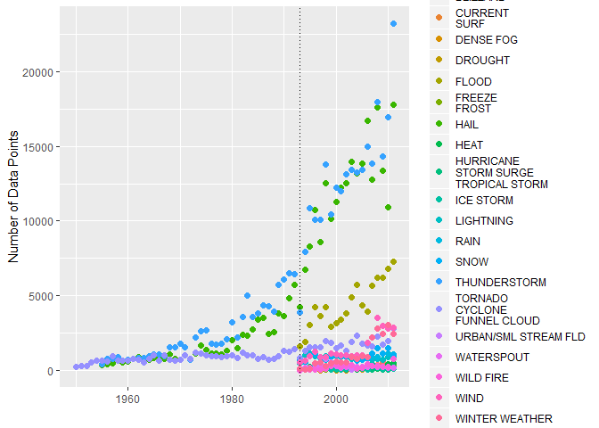
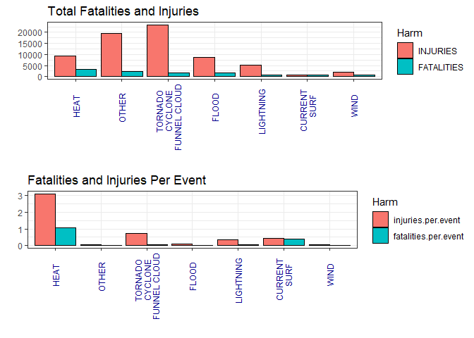
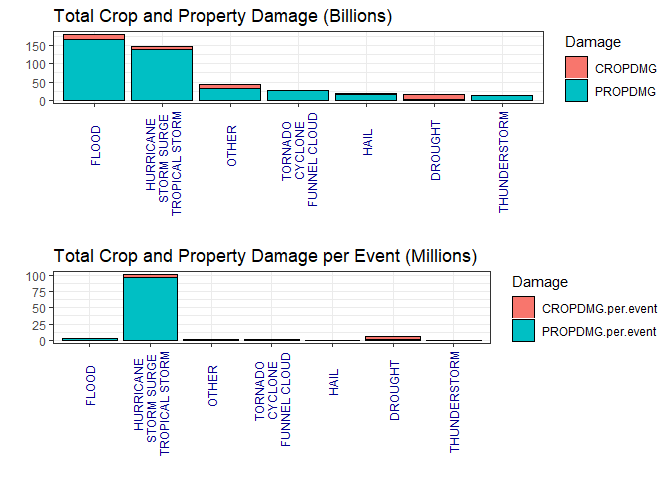

# Synopsis

* Across the United States, which types of events (as indicated in the EVTYPE 
variable) are most harmful with respect to population health?  

    + Health harm will be measured in fatalities/injuries in both the total and average per event to understand the total harm these type of storms cause and the danger of individual events.  
    
    + In terms of population health, collectively heat and Tornados, Cyclone, Funnel clouds are the most dangerous events (though a combination of all miscellaneous under "OTHER" are second most dangerous).  Per Event, heat again is the biggerst danger with Tornados, Cyclone, Funnel clouds being 2nd most dangerous per event. 

* Across the United States, which types of events have the greatest economic consequences?  

    + This will be answered comparing the sum of historical crop and property damage.  This will be measured in both the total and average per event to understand the total economic damage these type of storms and the average cost for individual events.  
    
    + In terms of total economic damage, floods and hurricanes, storm surge and tropical storm are most costly.  Individual flood events don't cause much damage but the event happens frequently, while hurricanes, storm surge and tropical storms are less frequent but very costly per event.
    
# Session Info


```r
sessionInfo()
```

```
## R version 3.4.4 (2018-03-15)
## Platform: x86_64-w64-mingw32/x64 (64-bit)
## Running under: Windows 10 x64 (build 17134)
## 
## Matrix products: default
## 
## locale:
## [1] LC_COLLATE=English_United States.1252 
## [2] LC_CTYPE=English_United States.1252   
## [3] LC_MONETARY=English_United States.1252
## [4] LC_NUMERIC=C                          
## [5] LC_TIME=English_United States.1252    
## 
## attached base packages:
## [1] stats     graphics  grDevices utils     datasets  methods   base     
## 
## loaded via a namespace (and not attached):
##  [1] compiler_3.4.4  magrittr_1.5    tools_3.4.4     htmltools_0.3.6
##  [5] yaml_2.2.0      Rcpp_1.0.0      stringi_1.3.1   rmarkdown_1.11 
##  [9] knitr_1.22      stringr_1.4.0   xfun_0.4        digest_0.6.18  
## [13] evaluate_0.13
```

# Packages Installed


```r
library(dplyr)
```

```
## 
## Attaching package: 'dplyr'
```

```
## The following objects are masked from 'package:stats':
## 
##     filter, lag
```

```
## The following objects are masked from 'package:base':
## 
##     intersect, setdiff, setequal, union
```

```r
library(stringr)
library(ggplot2)
library(forcats)
library(reshape2)
library(gridExtra)
```

```
## 
## Attaching package: 'gridExtra'
```

```
## The following object is masked from 'package:dplyr':
## 
##     combine
```

```r
library(lubridate)
```

```
## 
## Attaching package: 'lubridate'
```

```
## The following object is masked from 'package:base':
## 
##     date
```


# Data Processing

* Data source is https://d396qusza40orc.cloudfront.net/repdata%2Fdata%2FStormData.csv.bz2  

* Other data documentation is https://d396qusza40orc.cloudfront.net/repdata%2Fpeer2_doc%2Fpd01016005curr.pdf and https://d396qusza40orc.cloudfront.net/repdata%2Fpeer2_doc%2FNCDC%20Storm%20Events-FAQ%20Page.pdf  

* Data was analyzed and it was found many type of events were not reported before 1993.  Therefore range of dataset analysis is 1993-2011  

* Raw data inputted with blanks entries replaced as NA  

* CROPDMGEXP and PROPDMGEXP was data cleaned according to the methodology outlined at https://rstudio-pubs-static.s3.amazonaws.com/58957_37b6723ee52b455990e149edde45e5b6.html, converted into a number and multiplied with CROPDMG and PROPDMG respectively  

* TOTALDMG was calculated as a sum of CROPDMP and PROPDMG  

* EVTYPE was consolidated and data cleaned into top 6 EVTYPES for health harm and economic damage respectively, with the remaining event types being lumped into a "OTHER"  

* Two summations of health harm and economics were created - total amount of health harm and economic damage, and average health harm per event and average economic damage per event  


```r
if(!exists("raw.data")){
        raw.data <- read.csv("repdata_data_StormData.csv.bz2", 
                             na.strings = c("",NA))

raw.data$BGN_DATE <- year(as.Date(raw.data$BGN_DATE,"%m/%d/%Y"))}

head(raw.data)
```

```
##   STATE__ BGN_DATE BGN_TIME TIME_ZONE COUNTY COUNTYNAME STATE  EVTYPE
## 1       1     1950     0130       CST     97     MOBILE    AL TORNADO
## 2       1     1950     0145       CST      3    BALDWIN    AL TORNADO
## 3       1     1951     1600       CST     57    FAYETTE    AL TORNADO
## 4       1     1951     0900       CST     89    MADISON    AL TORNADO
## 5       1     1951     1500       CST     43    CULLMAN    AL TORNADO
## 6       1     1951     2000       CST     77 LAUDERDALE    AL TORNADO
##   BGN_RANGE BGN_AZI BGN_LOCATI END_DATE END_TIME COUNTY_END COUNTYENDN
## 1         0    <NA>       <NA>     <NA>     <NA>          0         NA
## 2         0    <NA>       <NA>     <NA>     <NA>          0         NA
## 3         0    <NA>       <NA>     <NA>     <NA>          0         NA
## 4         0    <NA>       <NA>     <NA>     <NA>          0         NA
## 5         0    <NA>       <NA>     <NA>     <NA>          0         NA
## 6         0    <NA>       <NA>     <NA>     <NA>          0         NA
##   END_RANGE END_AZI END_LOCATI LENGTH WIDTH F MAG FATALITIES INJURIES
## 1         0    <NA>       <NA>   14.0   100 3   0          0       15
## 2         0    <NA>       <NA>    2.0   150 2   0          0        0
## 3         0    <NA>       <NA>    0.1   123 2   0          0        2
## 4         0    <NA>       <NA>    0.0   100 2   0          0        2
## 5         0    <NA>       <NA>    0.0   150 2   0          0        2
## 6         0    <NA>       <NA>    1.5   177 2   0          0        6
##   PROPDMG PROPDMGEXP CROPDMG CROPDMGEXP  WFO STATEOFFIC ZONENAMES LATITUDE
## 1    25.0          K       0       <NA> <NA>       <NA>      <NA>     3040
## 2     2.5          K       0       <NA> <NA>       <NA>      <NA>     3042
## 3    25.0          K       0       <NA> <NA>       <NA>      <NA>     3340
## 4     2.5          K       0       <NA> <NA>       <NA>      <NA>     3458
## 5     2.5          K       0       <NA> <NA>       <NA>      <NA>     3412
## 6     2.5          K       0       <NA> <NA>       <NA>      <NA>     3450
##   LONGITUDE LATITUDE_E LONGITUDE_ REMARKS REFNUM
## 1      8812       3051       8806    <NA>      1
## 2      8755          0          0    <NA>      2
## 3      8742          0          0    <NA>      3
## 4      8626          0          0    <NA>      4
## 5      8642          0          0    <NA>      5
## 6      8748          0          0    <NA>      6
```

```r
#remove columns that will not be needed
intermediate.data <- raw.data %>%
        select(EVTYPE,BGN_DATE, FATALITIES,INJURIES,PROPDMG,PROPDMGEXP,
               CROPDMG,CROPDMGEXP)

#change EXP values to exponents according to value system

#H,h,K,k,M,m,B,b,+,-,?,0,1,2,3,4,5,6,7,8, and blank-character
#H,h = hundreds = 100
#K,k = kilos = thousands = 1,000
#M,m = millions = 1,000,000
#B,b = billions = 1,000,000,000
#(+) = 1
#(-) = 0
#(?) = 0
#black/empty character = 0
#numeric 0..8 = 10

intermediate.data$PROPDMGEXP <- intermediate.data$PROPDMGEXP %>% 
        str_replace_all(c("\\+" = "1", "\\-" = "0", "\\?" = "0",
                         "[1-8]" = "10", "[hH]" = "100", "[kK]" = "1e+03", 
                         "[mM]" = "1e+06", "[bB]" = "1e+09")) %>%
        as.numeric()

intermediate.data$PROPDMGEXP[is.na(intermediate.data$PROPDMGEXP)] <- 0

intermediate.data$CROPDMGEXP <- intermediate.data$CROPDMGEXP %>% 
        str_replace_all(c("\\+" = "1", "\\-" = "0", "\\?" = "0",
                          "[1-8]" = "10", "[hH]" = "100", "[kK]" = "1e+03", 
                          "[mM]" = "1e+06", "[bB]" = "1e+09")) %>%
        as.numeric()

intermediate.data$CROPDMGEXP[is.na(intermediate.data$CROPDMGEXP)] <- 0

#multiply column with EXP

intermediate.data <- intermediate.data %>%
        transform(PROPDMG = PROPDMG * PROPDMGEXP) %>%
        transform(CROPDMG = CROPDMG * CROPDMGEXP) %>%
        mutate(TOTALDMG = CROPDMG + PROPDMG) %>%
        select(-PROPDMGEXP,-CROPDMGEXP)
        

#clean up EVTYPE entries
#subset EVTYPE =  summary entries, propdmg cropdmg values are zero - REMOVE
summary <- raw.data[grep("summary.*", raw.data$EVTYPE, ignore.case = TRUE),]

#how many hurrican entries?

hurricane <- raw.data[grep("hurricane.*", raw.data$EVTYPE, ignore.case = TRUE),]


#need to set up priority in naming to consolidate names


#check how many factors
distribution.EVTYPE <- aggregate(x = raw.data, by = list(raw.data$EVTYPE), 
                                 FUN = length)

#first, standardize same name
intermediate.data <- intermediate.data %>%
        #remove typos
        filter(!grepl("summary.*|\\?|.*apache.*", EVTYPE, ignore.case = TRUE)) %>%
        #standardize names
        transform(EVTYPE = gsub(".*hurricane.*|.*storm surge.*|.*tropical.*", 
                                "HURRICANE\nSTORM SURGE\nTROPICAL STORM", 
                                EVTYPE, ignore.case = TRUE)) %>%
        transform(EVTYPE = gsub(".*flood.*", "FLOOD", EVTYPE, 
                                ignore.case = TRUE)) %>%
        transform(EVTYPE = gsub(".*TSTM.*|.*THUNDERSTORM.*", "THUNDERSTORM", 
                                EVTYPE, ignore.case = TRUE)) %>%
        transform(EVTYPE = gsub(".*cyclone.*|.*tornado.*|.*funnel cloud.*|torndao", 
                                "TORNADO\nCYCLONE\nFUNNEL CLOUD", EVTYPE, 
                                ignore.case = TRUE)) %>%
        transform(EVTYPE = gsub(".*wind.*", "WIND", EVTYPE, 
                                ignore.case = TRUE)) %>%        
        transform(EVTYPE = gsub(".*blizzard.*", "BLIZZARD", EVTYPE, 
                                ignore.case = TRUE)) %>%
        transform(EVTYPE = gsub(".*microburst.*", "MICROBURST", EVTYPE, 
                                ignore.case = TRUE)) %>%
        transform(EVTYPE = gsub(".*freez.*|.*frost.*", "FREEZE\nFROST", EVTYPE, 
                                ignore.case = TRUE)) %>%
        transform(EVTYPE = gsub(".*hail.*", "HAIL", EVTYPE, 
                                ignore.case = TRUE)) %>%
        transform(EVTYPE = gsub(".*snow.*", "SNOW", EVTYPE, 
                                ignore.case = TRUE)) %>%
        transform(EVTYPE = gsub(".*light.*", "LIGHTNING", EVTYPE, 
                                ignore.case = TRUE)) %>%
        transform(EVTYPE = gsub(".*wint.*", "WINTER WEATHER", EVTYPE, 
                                ignore.case = TRUE)) %>%
        transform(EVTYPE = gsub(".*rain.*|.*shower.*|.*precipitation.*", "RAIN", 
                                EVTYPE, ignore.case = TRUE)) %>%
        transform(EVTYPE = gsub(".*cold.*", "COLD", EVTYPE, 
                                ignore.case = TRUE)) %>%
        transform(EVTYPE = gsub(".*wild.*|.*fire.*", "WILD FIRE", EVTYPE, 
                                ignore.case = TRUE)) %>%
        transform(EVTYPE = gsub(".*flood.*", "FLOOD", EVTYPE, 
                                ignore.case = TRUE)) %>%
        transform(EVTYPE = gsub(".*mud.*|.*land.*", "MUD-LAND\nSLIDE", EVTYPE, 
                                ignore.case = TRUE)) %>%
        transform(EVTYPE = gsub(".*heat.*|.*hot.*|.*warm.*", "HEAT", EVTYPE, 
                                ignore.case = TRUE)) %>%
        transform(EVTYPE = gsub(".*surf.*|.*current.*|.*swell.*", 
                                "CURRENT\nSURF", EVTYPE, 
                                ignore.case = TRUE)) 

distribution.check <- aggregate(BGN_DATE~EVTYPE, intermediate.data, length)

distribution.check <- distribution.check[order(-distribution.check$BGN_DATE),]

exploratory <- filter(intermediate.data, EVTYPE %in% distribution.check$EVTYPE[1:20])

exploratory <- aggregate(TOTALDMG~BGN_DATE+EVTYPE, exploratory, length)

f <- ggplot(data = exploratory, aes(x = BGN_DATE, y = TOTALDMG)) +
        geom_point(aes(colour = factor(EVTYPE)), size = 2) +
        ylab("Number of Data Points") + xlab("") +
        geom_vline(xintercept=c(1993), linetype="dotted")
```

Ran an exploratory graph and noticed that many types of event were not recorded till 1993.  Therefore only data from 1993 was used in analysis


```r
plot(f)
```

<!-- -->

```r
intermediate.data <- filter(intermediate.data,BGN_DATE >1992)

head(intermediate.data)
```

```
##           EVTYPE BGN_DATE FATALITIES INJURIES PROPDMG CROPDMG TOTALDMG
## 1  FREEZE\nFROST     1995          0        0   0e+00       0    0e+00
## 2           SNOW     1995          0        0   0e+00       0    0e+00
## 3          FLOOD     1994          0        2   0e+00       0    0e+00
## 4           SNOW     1995          0        0   0e+00       0    0e+00
## 5 WINTER WEATHER     1993          4        0   5e+09       0    5e+09
## 6           SNOW     1995          0        0   0e+00       0    0e+00
```

```r
#check how many factors left
EVTYPE.range <- unique(intermediate.data$EVTYPE)

#Across the United States, which types of events (as indicated in the 
#EVTYPE variable) are most harmful with respect to population health?

#What columns are relevant to population health? - injuries, fatalities
#aggregate fatalities and injuries accordinng to event type
health.harm.EVTYPE <- aggregate(cbind(FATALITIES,INJURIES)~EVTYPE, 
                                intermediate.data, sum)

#count number of times same events happens
health.harm.EVTYPE.freq <- aggregate(FATALITIES~EVTYPE, 
                                     intermediate.data, length)

health.harm.EVTYPE.freq <- health.harm.EVTYPE.freq %>%
        rename(EVENT.FREQUENCY = FATALITIES)
        
health.harm.EVTYPE <- inner_join(health.harm.EVTYPE, health.harm.EVTYPE.freq, 
                                 by = "EVTYPE")


#calculate number of fatalities and injuries per event
health.harm.EVTYPE <- health.harm.EVTYPE %>%
        mutate(fatalities.percent = round(FATALITIES/sum(FATALITIES),3)) %>%
        mutate(injuries.percent = round(INJURIES/sum(INJURIES),3)) %>%
        arrange(desc(FATALITIES))
 
#rename all event types that are not top 6 into other
health.harm.EVTYPE$EVTYPE <- fct_other(health.harm.EVTYPE$EVTYPE,
                                       keep = health.harm.EVTYPE$EVTYPE[1:6],
                                       other_level = "OTHER")

#aggregate fatalities and injuries per event
health.harm.EVTYPE <- aggregate(.~EVTYPE, health.harm.EVTYPE, sum)

health.harm.EVTYPE <- health.harm.EVTYPE %>%
        mutate(fatalities.per.event = round(FATALITIES/EVENT.FREQUENCY,2)) %>%
        mutate(injuries.per.event = round(INJURIES/EVENT.FREQUENCY,2))

head(health.harm.EVTYPE)
```

```
##                           EVTYPE FATALITIES INJURIES EVENT.FREQUENCY
## 1                  CURRENT\nSURF        736      775            1844
## 2                          FLOOD       1525     8604           82731
## 3                           HEAT       3178     9243            2993
## 4                      LIGHTNING        817     5231           15767
## 5 TORNADO\nCYCLONE\nFUNNEL CLOUD       1624    23374           32871
## 6                           WIND        696     1994           28180
##   fatalities.percent injuries.percent fatalities.per.event
## 1              0.068            0.011                 0.40
## 2              0.140            0.125                 0.02
## 3              0.292            0.134                 1.06
## 4              0.075            0.076                 0.05
## 5              0.149            0.340                 0.05
## 6              0.064            0.029                 0.02
##   injuries.per.event
## 1               0.42
## 2               0.10
## 3               3.09
## 4               0.33
## 5               0.71
## 6               0.07
```

```r
#What columns are revelant to economic consequence? - PROPDMG, PROPDMGEXP, 
#CROPDMG, CROPDMGEXP

economic.EVTYPE <- aggregate(cbind(PROPDMG,CROPDMG,TOTALDMG)~EVTYPE, 
                             intermediate.data, sum)

#count number of times same events happens
economic.EVTYPE.freq <- aggregate(PROPDMG~EVTYPE, 
                                     intermediate.data, length)

economic.EVTYPE.freq <- economic.EVTYPE.freq %>%
        rename(EVENT.FREQUENCY = PROPDMG)

economic.EVTYPE <- inner_join(economic.EVTYPE, economic.EVTYPE.freq, 
                                 by = "EVTYPE")

#calculate total damage
economic.EVTYPE <- economic.EVTYPE %>%
        mutate(percent = round(TOTALDMG/sum(TOTALDMG),3)) %>%
        arrange(desc(TOTALDMG))

#rename all event types that are not top 6 into other
economic.EVTYPE$EVTYPE <- fct_other(economic.EVTYPE$EVTYPE,
                                       keep = economic.EVTYPE$EVTYPE[1:6],
                                       other_level = "OTHER")

economic.EVTYPE <- aggregate(.~EVTYPE, economic.EVTYPE, sum)

#aggregate all types of economic damage per event
economic.EVTYPE <- economic.EVTYPE %>%
        mutate(TOTALDMG.per.event = round(TOTALDMG/EVENT.FREQUENCY,0)) %>%
        mutate(PROPDMG.per.event = round(PROPDMG/EVENT.FREQUENCY,0)) %>%
        mutate(CROPDMG.per.event = round(CROPDMG/EVENT.FREQUENCY,0))

head(economic.EVTYPE)
```

```
##                                   EVTYPE      PROPDMG     CROPDMG
## 1                                DROUGHT   1046106000 13972566000
## 2                                  FLOOD 167529741508 12380109100
## 3                                   HAIL  15974043520  3046837450
## 4 HURRICANE\nSTORM SURGE\nTROPICAL STORM 140437031560  6211043800
## 5                           THUNDERSTORM  12575592791  1274178900
## 6         TORNADO\nCYCLONE\nFUNNEL CLOUD  26395095882   414961360
##       TOTALDMG EVENT.FREQUENCY percent TOTALDMG.per.event
## 1  15018672000            2488   0.034            6036444
## 2 179909850608           82731   0.404            2174636
## 3  19020880970          227442   0.043              83630
## 4 146648075360            1454   0.329          100858374
## 5  13849771691          245839   0.031              56337
## 6  26810057242           32871   0.060             815614
##   PROPDMG.per.event CROPDMG.per.event
## 1            420461           5615983
## 2           2024994            149643
## 3             70233             13396
## 4          96586679           4271694
## 5             51154              5183
## 6            802990             12624
```

# RESULTS

```r
#Across the United States, which types of events (as indicated in the EVTYPE 
#variable) are most harmful with respect to population health?


#create tall dataframe for charting purposes
health.harm.total <- health.harm.EVTYPE %>%
        select(EVTYPE,FATALITIES,INJURIES) %>%
        melt(id.vars = "EVTYPE", measure.vars = c("FATALITIES","INJURIES")) 

health.harm.total <- health.harm.total[order(health.harm.total$variable, 
                                             -health.harm.total$value),] 

#set descending order of event type factors
EVTYPE.ORDER <- health.harm.total %>%
        filter(variable == "FATALITIES") %>%
        select(-variable,-value)
        
health.harm.total$EVTYPE <- factor(health.harm.total$EVTYPE, 
                                   levels = EVTYPE.ORDER$EVTYPE)

health.harm.total$variable <- factor(health.harm.total$variable, 
                                     levels = c("INJURIES","FATALITIES"))

#graph total fatalities and injuries
g <- ggplot(data=health.harm.total, aes(x=EVTYPE, y=value, 
                                        fill=factor(variable))) +
        geom_bar(colour="black", stat="identity",
                 position=position_dodge(),
                 size=.3, width = .9) + 
        theme_bw() +
        scale_fill_hue(name="Harm") + 
        xlab("") + ylab("") +
        ggtitle("Total Fatalities and Injuries") +
        theme(axis.text.x = element_text(angle = 90, hjust = 0.75, vjust = 0.5, 
                                         size=9,color="darkblue"))


health.harm.per.event <- health.harm.EVTYPE %>%
                select(EVTYPE,fatalities.per.event,injuries.per.event) %>%
                melt(id.vars = "EVTYPE", measure.vars = c("fatalities.per.event",
                                                          "injuries.per.event"))

health.harm.per.event$EVTYPE <- factor(health.harm.per.event$EVTYPE, 
                                       levels = EVTYPE.ORDER$EVTYPE)
health.harm.per.event$variable <- factor(health.harm.per.event$variable, 
                                         levels = c("injuries.per.event",
                                                    "fatalities.per.event"))

#graph fatalities and injuries per event 
h <- ggplot(data=health.harm.per.event, aes(x=EVTYPE, y=value, 
                                            fill=factor(variable))) +
        
                geom_bar(colour="black", stat="identity",
                         position=position_dodge(),
                         size=.3) +                       
                scale_fill_hue(name="Harm") + xlab("") + ylab("") +
        ggtitle("Fatalities and Injuries Per Event") + theme_bw() +
        theme(axis.text.x = element_text(angle = 90, hjust = 0.75, vjust = 0.5, 
                                         size=9,color="darkblue"))

#print plot
grid.arrange(g,h, ncol=1)
```

<!-- -->

```r
#Across the United States, which types of events have the greatest economic consequences?

#create tall dataframe for charting purposes
economic.total <- economic.EVTYPE %>%
                select(EVTYPE,PROPDMG,CROPDMG,TOTALDMG) %>%
                melt(id.vars = "EVTYPE", measure.vars = c("PROPDMG","CROPDMG","TOTALDMG"))

economic.total <- economic.total[order(economic.total$variable, -economic.total$value),] 

#set factor order according to largest total damage
EVTYPE.ORDER <- economic.total %>%
        filter(variable == "TOTALDMG") %>%
        select(-variable,-value)

economic.total <- filter(economic.total, variable != "TOTALDMG")

economic.total$EVTYPE <- factor(economic.total$EVTYPE, levels = EVTYPE.ORDER$EVTYPE)       
economic.total$variable <- factor(economic.total$variable, levels = c("CROPDMG",
                                                                      "PROPDMG"))
#graph total prop and crop damage     
i <- ggplot(data=economic.total, aes(x=EVTYPE, y=value/1e+09, fill=factor(variable))) +
                geom_bar(colour="black", stat="identity",
                         position="stack", size=.3) +                       
                scale_fill_hue(name="Damage") + xlab("") + ylab("") +
        ggtitle("Total Crop and Property Damage (Billions)") + theme_bw() +
        theme(axis.text.x = element_text(angle = 90, hjust = 0.75, vjust = 0.5, 
                                         size=9,color="darkblue"))
    
        
economic.per.event <- economic.EVTYPE %>%
                select(EVTYPE,PROPDMG.per.event,CROPDMG.per.event) %>%
                melt(id.vars = "EVTYPE", measure.vars = c("PROPDMG.per.event",
                                                          "CROPDMG.per.event"))
        
economic.per.event <- economic.per.event[order(economic.per.event$variable, 
                                               -economic.per.event$value),] 

#set order of factors in descending damage cost
economic.per.event$EVTYPE <- factor(economic.per.event$EVTYPE, 
                                    levels = EVTYPE.ORDER$EVTYPE)       
economic.per.event$variable <- factor(economic.per.event$variable, 
                                      levels = c("CROPDMG.per.event",
                                                 "PROPDMG.per.event"))

#graph total prop and crop damage per event       
j <- ggplot(data=economic.per.event, aes(x=EVTYPE, y=value/1e+06, 
                                         fill=factor(variable))) +
        
                geom_bar(colour="black", stat="identity",
                         position="stack", size=.3) +                       
                scale_fill_hue(name="Damage") + xlab("") + ylab("") +
        ggtitle("Total Crop and Property Damage per Event (Millions)") +    
                theme_bw() +
        theme(axis.text.x = element_text(angle = 90, hjust = 0.75, vjust = 0.5, 
                                         size=9,color="darkblue"))

        
        
#print plot        
grid.arrange(i,j, ncol=1)
```

<!-- -->
