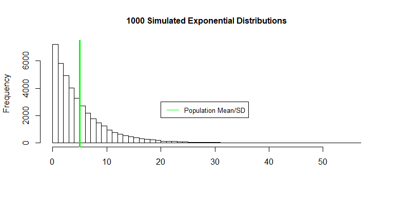
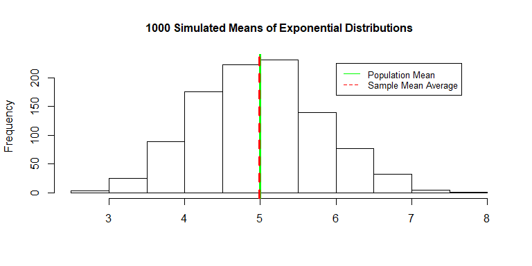

### Overview
This report will explore the Central Thereom Limit, simulating 1000 exponential distribution of 40 observations.  The sample mean and variance will be compared to the theoretical mean and variance as stated by Central Limit Theorem.
    
### Simulations

Exponential parameters mean, standard deviation and variance were calculated in the code below.


```r
lambda = 0.2
n <- 40
pop.mean <- 1/lambda
pop.sd <- 1/lambda
pop.variance <- 1/lambda^2
```
The exponential distribution was simulated using the R function rexp(n, lambda). The rate parameter ($\lambda$) is 0.2 for all of the simulations.    
  
The code below simulates a 1000 exponential distributions and illustrates the distribution of a 1000 simulated exponential distributions means.

```r
expo <- NULL
for (i in 1 : 1000) expo = c(expo, rexp(40, 0.2))
expo_mean <- NULL
for (i in 1 : 1000) expo_mean = c(expo_mean, mean(rexp(40, 0.2)))
```

### Sample Mean versus Theoretical Mean

The figure below shows the exponential simulations and the population mean/standard deviation 5. The population mean and standard deviation are both defined as $1/\lambda$.


```r
hist(expo, xlab = "", breaks = 50, main = "1000 Simulated Exponential Distributions", cex.main = 1)
abline(v =5, col = "green", lwd = 3)
legend(20, 3000, legend="Population Mean/SD",
       col="green", lty=1, cex = 0.8)
```

<!-- -->

The figure below shows a sample of 1000 exponential distribution means. The theoretical mean 5 (which equals the population mean) and sample mean 4.98 are very close as predicted by Central Limit Theorem.

```r
hist(expo_mean, xlab = "", main = "1000 Simulated Means of Exponential Distributions", cex.main =1)
abline(v = 5, col = "green", lwd = 3)
abline(v = mean(expo_mean), col = "red", lwd = 3, lty =2)
legend(6, 225, legend = c("Population Mean", "Sample Mean Average"),
       col=c("green","red"), lty=c(1,2), cex = 0.8)
```

<!-- -->

### Sample Variance versus Theoretical Variance

```r
theor.variance <- pop.variance/n
sam.variance <- var(expo_mean)
```
The population variance for an exponential distribution is $1/\lambda^2$.  Therefore, the theoretical variance is calculated using the normal distribution variance formula $Var = \sigma^2/n$ which equals $Var = 1/\lambda^2/n$.  The sample variance 0.663 and theoretical variance 0.625 are very close, which is also predicted by the Central Limit Theorem.

### Distribution


```r
h <- hist(expo_mean, breaks = 10, density = 20,
          col = "lightgray", ylim = c(0,350), xlab = "",
          main = "1000 Simulated Exponential Distributions Means \n vs Normal Distribution", cex.main = 1) 
xfit <- seq(min(expo_mean), max(expo_mean), length = 40) 
yfit <- dnorm(xfit, mean = mean(expo_mean), sd = sd(expo_mean)) 
yfit <- yfit * diff(h$mids[1:2]) * length(expo_mean) 
lines(xfit, yfit, col = "black", lwd = 2)
```

<!-- -->

The figure above overlays a normal distribution on top of a historgram of the sampled 1000 exponential distribution means.  The normal distribution has the same mean and and standard deviation as the sampled 1000 exponential distribution means.  The histogram and normal distribution has a similar profile indicating the distribution is normal.
